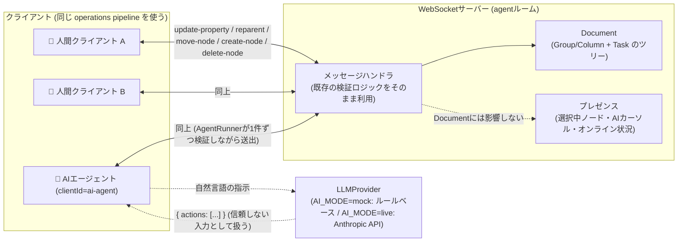

# figma-sync-demo

Figmaの同時編集の仕組みを、Node.js + WebSocketの最小構成で再現し、
動かしながら検証するためのリポジトリです。

対応するQiita記事:
「Figmaの同時編集、なめらかすぎない？Notion・スプレッドシートとの動画比較から、
Figmaの仕組みを調べてみた」の実装編（近日公開）

## 再現している4つの仕組み

Figma公式ブログ（[How Figma's multiplayer technology works](https://www.figma.com/blog/how-figmas-multiplayer-technology-works/)）
で説明されている以下の4つを、それぞれ独立したシナリオスクリプトとして実装しています。

| # | 仕組み | 実装 | 確認スクリプト |
|---|---|---|---|
| 1 | LWW (Last-Writer-Wins) によるプロパティ同期 | `server/document.js` の `applyPropertyUpdate` | `npm run scenario:lww` |
| 2 | 楽観的更新と flickering 防止 | `client/DemoClient.js` の pendingOps による確定判定 | `npm run scenario:optimistic` |
| 3 | reparent と循環参照の一時的な発生・解消 | `server/document.js` の `reparent` / `isAncestor` | `npm run scenario:reparent` |
| 4 | Fractional Indexing による兄弟順序管理 | `shared/fractionalIndex.js` | `npm run scenario:fractional-index` |

## セットアップ

```bash
npm install
```

## ブラウザでUIを見ながら確認する (推奨)

`npm run server` でサーバーを起動し、ブラウザで `http://localhost:8080` を
**2つのタブ (または2つのウィンドウ) で開く** と、Figmaのように実際にドラッグ・
色変更・親子関係の変更をしながら、もう片方の画面にリアルタイムで反映される様子を
確認できます。

```bash
npm run server
# ブラウザで http://localhost:8080 を2つのタブで開く
```

- ノードをドラッグして動かす → 楽観的更新とflickering防止(もう片方のタブにもスムーズに反映される)
- サイドバーの「親」プルダウンを変更する、またはノードを別のノードの上にドロップする → reparent(2つのタブで同時に逆方向のreparentを行うと、片方が循環参照として拒否され、赤く光って巻き戻る)
- サイドバーの ↑↓ ボタンで並び替える → Fractional Indexingによる順序管理
- カーソルを動かす / 何もない場所をドラッグする → マルチプレイヤーカーソルと範囲選択の同期(Figmaでよく見る、他人のカーソルが動いているアレ)
- ノードをクリックする → 選択中のノードが誰の目にも分かるように、選択した人の色で枠線とラベルが表示される(もう片方のタブでも同じ枠線が見える)

LWWによるプロパティ同期は、UIではなく `npm run scenario:lww` のシナリオスクリプトで確認できます。

画面右側にはイベントログが流れ、「楽観的に適用」「確定(再描画なし)」「受信して反映」
「拒否(循環参照)→巻き戻し」といったログで、裏側で何が起きているかも同時に確認できます。

### flickering防止のON/OFF比較

ツールバーの「flickering防止」チェックボックスをOFFにすると、自分が出した操作の
確定通知が届くたびに、その時点でサーバーから届いた(わずかに遅れた)値へ強制的に
再描画するようになります。タブを1つだけ開いて、ノードを素早くドラッグしてみてください。

- **ON(デフォルト)**: マウスの動きにそのまま追従してなめらかに動く
- **OFF**: ドラッグ中に、マウスの位置より少し遅れた座標へノードが一瞬引き戻される「カクつき」が発生する

2つのタブを開かなくても、1人の操作だけでFigma記事にある「flickering」を体感できます。

## 動かし方

各シナリオはサーバーの起動からクライアントの接続・操作・終了まで
1本のスクリプトで完結しています。個別に実行できます。

```bash
npm run scenario:lww                # LWWによるプロパティ同期
npm run scenario:optimistic         # 楽観的更新とflickering防止
npm run scenario:reparent           # reparentと循環参照の解消
npm run scenario:fractional-index   # Fractional Indexingによる順序管理
```

サーバーを単独で立てて、自分で `client/DemoClient.js` を使った
スクリプトを書いて試したい場合は以下で起動できます。

```bash
npm run server
```

## 構成

```
server/         WebSocket/HTTPサーバーとドキュメントモデル (1ドキュメント=1サーバープロセス)
client/         クライアント側の楽観的更新・確定処理を持つ DemoClient (Node.js用)
client/public/  ブラウザで動くUI (index.html / app.js)。DemoClientと同じロジックをブラウザ向けに実装
                (agent.html / agent.js は下記のAI Agent Workspace用のUI)
shared/         Fractional Indexingの実装、サーバー起動ヘルパー
scenarios/      4つの仕組みをそれぞれ確認できるシナリオスクリプト
ai/             AI Agent Workspace用のLLMプロバイダー抽象化とAgentRunner
```

## AI Agent Workspace (おまけ機能)

「このデモで学んだ同期の仕組みは、人間同士だけでなくAIエージェントを
共同編集者として迎え入れる場合にもそのまま使えるのでは？」という発想を
実際に実装してみた、Kanbanボード風のもう1つのワークスペースです。
通常デモ画面のツールバーにある「🤖 おまけ: Agent Workspace」から遷移できます。

### コンセプト

- AIエージェントは特別扱いされたバックエンド処理ではなく、`clientId = "ai-agent"`
  を持つ**1人の共同編集者**として扱われます。
- AIは自分でDocumentを書き換えることはできません。必ず
  「自然言語の指示 → 構造化されたアクション列(JSON) → サーバー側での検証 →
  既存のドキュメント操作関数(`applyPropertyUpdate` / `reparent` / `moveNode` /
  `createNode` / `deleteNode`)を通した適用 → 既存のbroadcast経路での配信」
  という、人間の操作と全く同じパイプラインを通ります。
- reparentの循環参照拒否など、既存の検証ロジックはAIの操作にも完全に同じ形で
  適用されます(専用のバリデーションを別途作っているわけではなく、素通りさせているだけです)。
- ドキュメントの永続状態(タスクやカラム)と、プレゼンス情報(誰が今どのタスクを
  選択しているか、AIが今どのタスクにカーソルを向けているか)は、この記事の本編と
  同様に明確に分離しています。AIの「動いている感」の演出(カーソル移動・選択枠)は
  すべてプレゼンス側の一時的な情報であり、Document自体には一切影響しません。



### 起動方法

```bash
npm run server
# ブラウザで http://localhost:8080/agent.html を開く (複数タブでも可)
```

デフォルトでは `AI_MODE=mock` で動作するため、**APIキーは一切不要**です。
ツールバーの「デモデータ再投入」でボードを初期状態に戻せます。

### AI_MODE と環境変数

| 環境変数 | 説明 |
|---|---|
| `AI_MODE` | `mock` (デフォルト) はルールベースの決定的な動作。`live` にすると実際のLLMを呼び出す |
| `ANTHROPIC_API_KEY` | `AI_MODE=live` のときのみ使用。サーバー側の環境変数としてのみ読み込まれ、ブラウザには一切送信されない |
| `ANTHROPIC_MODEL` | 任意。`AI_MODE=live` 時に使うモデル名 (デフォルト: `claude-3-5-haiku-20241022`) |

`AI_MODE=live` を指定していても `ANTHROPIC_API_KEY` が無い場合は、自動的に
モックプロバイダーにフォールバックします(公開デモを誰でもAPIコスト無しで
動かせるようにするための設計です)。

```bash
AI_MODE=live ANTHROPIC_API_KEY=sk-ant-xxxx npm run server
```

### モックモードの挙動

`ai/MockLLMProvider.js` は本物の自然言語理解は行っておらず、単純なキーワード
一致で「完了にする」「進行中にする」「削除する」「追加する」を判定するだけの
決定的なロジックです。どのパターンにも一致しない自由な入力は、指示文そのものを
新しいタスクとしてTo Do列に追加するフォールバック動作になっており、
どんな指示を入れても必ず何かが起きるようになっています。

### 人間とAIの関係、Document状態とプレゼンスの違い

- 人間もAIも、サーバーから見れば「WebSocket接続 + clientId」という同じ形の
  クライアントです。AI用の特別なメッセージ型で直接Documentを書き換えるような
  抜け道は存在しません。
- Document状態(タスク・カラムのツリー構造)は全クライアントで共有され、
  サーバーの`Document`インスタンスに保持されます。
- プレゼンス情報(誰がどのタスクを選択中か、AIが今どこにカーソルを向けているか、
  AIが「考え中/作業中/待機中」のどの状態か)はDocumentとは別に扱われ、
  再接続すれば消える一時的な情報です。AIのカーソル移動や選択枠のアニメーションは
  すべてこちら側の仕組みで実現しており、Documentの整合性には一切関与しません。

### 動作確認したこと

- 既存の4つのシナリオスクリプト(`npm run scenario:*`)がすべて従来通り動作すること
- 通常デモ(`index.html`)とAgent Workspace(`agent.html`)が完全に独立したルーム
  (別々のDocumentとクライアント集合)として動作し、互いのメッセージが漏れないこと
- AIへの自然言語指示から、既存のreparent/create-node/delete-nodeの操作が
  人間の操作と同じ検証・ブロードキャスト経路で実行されること
- 循環参照になるreparentが、AIの操作であっても既存のロジックにより拒否されること
- `AI_MODE=mock`(APIキー無し)で全ての機能が動作すること

## 注意事項

これは記事解説用の最小構成デモであり、認証・永続化・スケーラビリティ等は
考慮していません。Figma公式ブログで説明されている2019年時点の設計をベースに、
概念を理解しやすい形に単純化しています。実際のFigmaの内部実装とは異なる場合があります。
